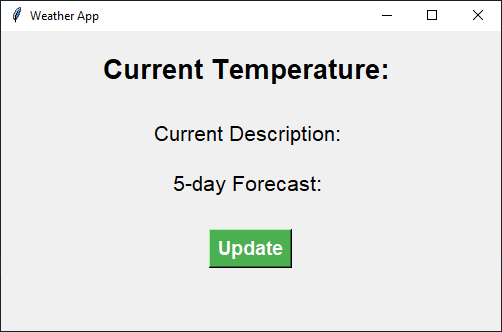

# Weather App

A simple weather application that displays the current weather conditions and 5-day forecast for a specified location. This application utilizes the OpenWeatherMap API to fetch the weather data.

## Getting Started

To get started with the weather app, follow these steps:

1. Clone the repository to your local machine
2. Install the required packages using `pip install -r requirements.txt`
3. Open `app.py` and enter your OpenWeatherMap API key and city name in the specified variables
4. Run the application using `python app.py`

## Features

The weather app provides the following features:

- Displays the current temperature and weather description
- Shows a 5-day forecast with the minimum and maximum temperature for each day
- Checks for weather alerts and displays a notification if any are found
- Allows the user to update the weather information by clicking on the update button

## Dependencies

The following packages are required to run the weather app:

- `tkinter` - GUI package for Python
- `requests` - HTTP library for Python

## Contributing

If you would like to contribute to the weather app, please fork the repository and create a pull request with your changes. 

## License

This project is licensed under the MIT License - see the [LICENSE](LICENSE) file for details.
